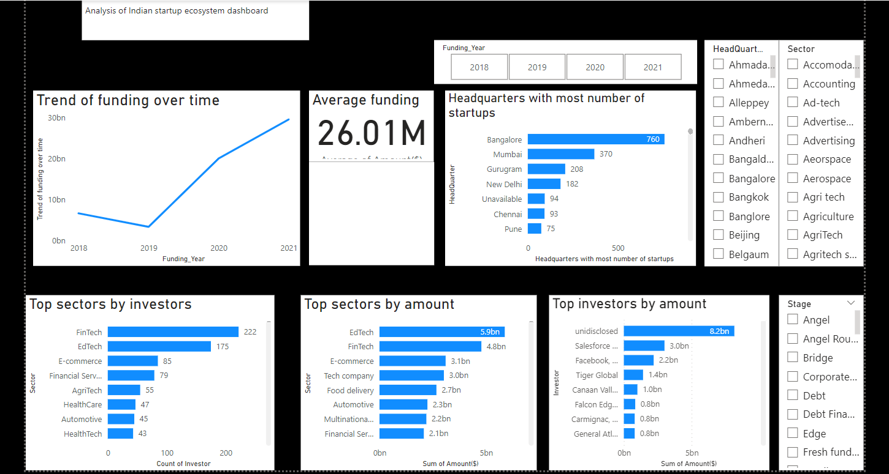

## Exploratory data analysis of indian start up ecosystem

### Introduction

This article presents a summary of my investigation and analysis of funding trends for Indian startups spanning from 2018 to 2021. This project aims to equip the team with the knowledge and strategic insights on identifying the most promising sectors, location, funding trends, and key players necessary to make informed decisions and successfully engage with the dynamic and rapidly evolving Indian start-up ecosystem.

### Tools and Programming Languages Used

VS Code
Microsoft PowerBI
GitHub & Git
Microsoft SQL Server
Python
Jupyter notebook
SQL

### The Columns used in the dataset include:

Company_Name: Name of the company/start-up

Founded: Year start-up was founded

Sector: Sector of service

What it does: Description about Company

Founders: Founders of the Company

Investor: Investors

Amount($): Raised fund

Stage: Round of funding reached

Headquarters: Location of the starup_company

### Research Questions

1.How has funding to startups changed over the period of time?

2.What is the average amount of funding for start-ups ?

3.Which headquarter is the most preferred startup location?

4.Which sectors are most favoured by investors?

5.What are the most common funding stages among indian startups?

6.Who are the top investors by the amount invested?

### Hypothesis

Null Hypothesis (H0): Funding to start-ups is centralized around specific sectors.

Alternative Hypothesis (H1): Funding to start-ups is spread across different sectors.

### Conclusion:

EdTech emerges as a top investment recommendation due to its robust funding and growing market. However, FinTech and Ecommerce also offer substantial potential. Key startup hubs like Bangalore, Mumbai, Gurugram, and New Delhi provide excellent support environments, and leading investors such as Salesforce Ventures, Silver Lake, and Tiger Global are pivotal in driving the ecosystem forward.

### Power BI visualization

